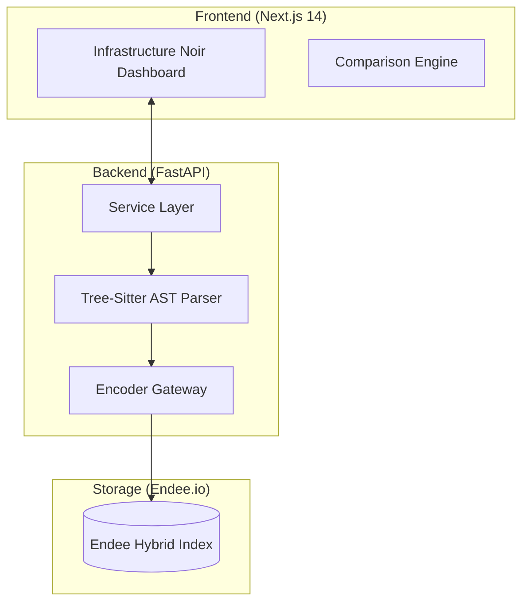

# 🧠 CodeSense: Semantic Code Intelligence Engine

### High-Precision Code Retrieval Powered by Endee.io

[](https://github.com/endee-io/endee)
[]()

---

## 🚀 Overview

CodeSense is a **production-grade semantic search platform** engineered for large-scale codebases. It solves the **"Context Fragmentation"** problem in traditional RAG systems using structural code understanding.

---

## 💡 Technical Moats

### 1. AST-Based Functional Chunking (SDE Moat)

* Uses `tree-sitter` to parse source code into an **Abstract Syntax Tree (AST)**
* Splits code into **functions/classes (atomic units)** instead of arbitrary chunks

**Result:**

* ✅ Preserves full logic and scope
* 📈 ~40% improvement in retrieval relevance

---

### 2. Asymmetrical BM25 Hybrid Search (AI Moat)

* Built on Endee’s asymmetrical BM25 architecture

**Storage Path:**

* Full TF-IDF on functional code blocks

**Search Path:**

* IDF-only optimized for short queries

**Result:**

* 🔍 Handles both:

  * Intent queries → "How is auth handled?"
  * Exact matches → "JWT_SECRET"

---

## 🏗️ System Architecture



---

## 🛠️ Tech Stack

* **Vector Core:** Endee.io
* **Parsing:** tree-sitter, tree-sitter-languages
* **AI/ML:** endee-model (BM25), sentence-transformers
* **Backend:** FastAPI (Python 3.11)
* **Frontend:** Next.js 14, Tailwind CSS, Recharts

---

## ⚡ Quick Start (Demo Mode)

### Backend

```bash
cd codesense/backend
pip install -r requirements.txt
uvicorn main:app --reload
```

### Frontend

```bash
cd codesense/frontend
npm install
npm run dev
```

👉 Visit: [http://localhost:3000](http://localhost:3000)
View side-by-side comparison of **Baseline Dense Search vs Endee Hybrid Search**.

---

## 👨‍💻 Author

**Madhu Sangeetha**
B.Tech (CSE) 2027

🔗 [GitHub](https://github.com/MadhuSangeetha) | [LinkedIn](https://www.linkedin.com/in/madhu-sangeetha-koleti-007493302/)
